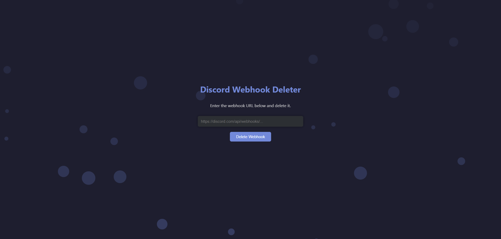

# Discord Webhook Deleter

A simple, elegant web tool that lets you **delete Discord webhooks instantly** using the official Discord API.  
Built with **HTML, CSS, and JavaScript (jQuery)** — lightweight, responsive, and visually clean with animated background bubbles.

---

## 🚀 Features
- 🔗 Input and delete any Discord webhook URL
- ⚡ Instant DELETE request via jQuery AJAX
- 🧭 Real-time feedback (success or error)
- 🎨 Animated bubble background for a dynamic look
- 💡 Minimal dependencies and clear code structure

---

## 📁 Project Structure
```
discord-webhook-deleter/
├── src/
│   ├── index.html   # Main page
│   ├── style.css    # Styling and animation
│   └── script.js    # Logic and interactions
└── media/
└── preview.png  # Screenshot or demo image
````

---

## 🧩 How to Use
1. Clone or download the repository:
   ```bash
   git clone https://github.com/your-username/discord-webhook-deleter.git
   ```

2. Open `index.html` in your browser.
3. Paste a valid Discord webhook URL.
4. Click **Delete Webhook**.

## ⚠️ Disclaimer

Deleting a webhook **cannot be undone**.
Use only with webhooks you own or have permission to remove.

---

## 📸 Preview


